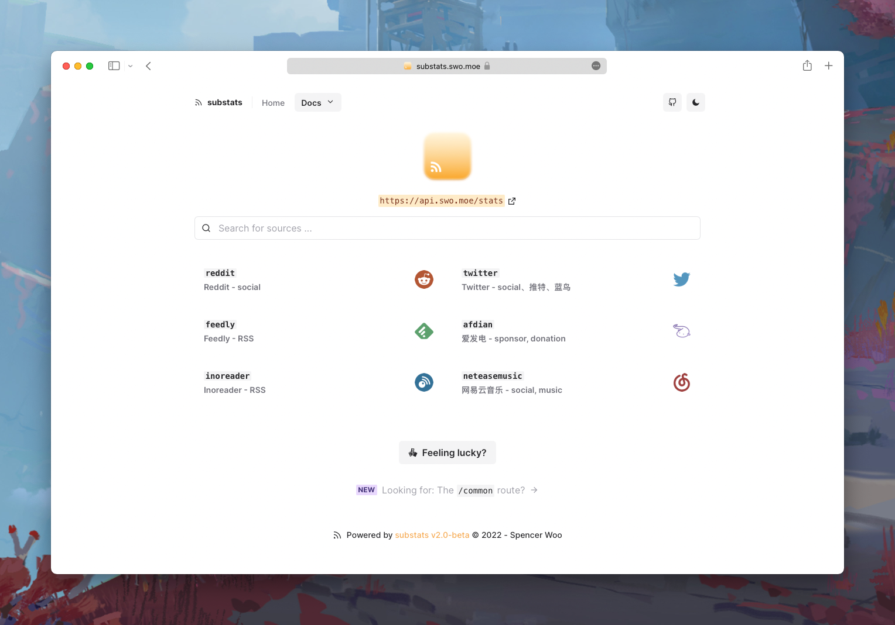
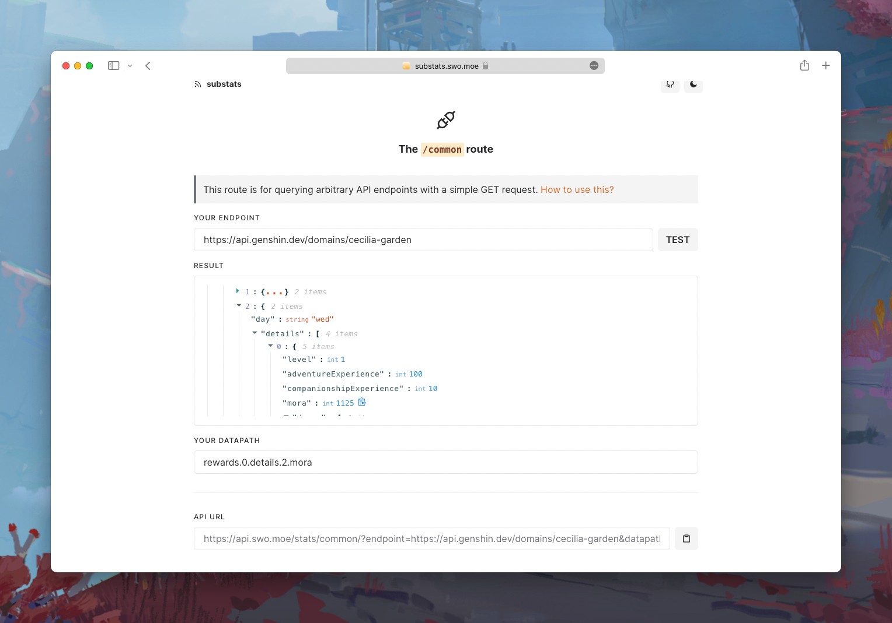

<div align="center">
  
  <h3><a href="https://api.swo.moe/stats">substats</a></h3>
  <p><a href="#get-started">Get started</a> · <a href="#whats-new">What's new?</a> · <a href="#sponsoring">Sponsoring</a></p>
  <p>( ｀д′) <em>how many followers do i have? how many!</em></p>

  
  
  <a href="https://github.com/spencerwooo/substats/actions?query=workflow%3ADeploy"></a>
</div>

## Get started

> sub · stats /səb ˈ stats/
>
> - a serverless api for getting the number of followers of you in your favourite services

_*Version 2.0 is still in `beta`, not all features are ported from 1.0. Check below for details 👇_

### Basic

```
https://api.swo.moe
```

You request:

```http
GET /stats/:source/:key
```

I respond:

```typescript
{
  source: string,
  key: string,
  failed: true | false,
  count: number | string  // Most often it's a number when source !== 'common'
}
```

Yep, it's that simple now. ;)

_*Note that `key` needs to be url encoded, remember this if you are requesting the `feedly`, `inoreader`, or `feedspub` routes._

### Building badges 🎫

Of course! And as a matter of fact, substats works quite well with [`shields.io`](https://shields.io)'s `/dynamic` route. All these badges below are dynamically generated with substat's data:

[](https://github.com/spencerwooo)
[](https://t.me/realSpencerWoo)
[](https://weibo.com/6265807914)
[](https://sspai.com/u/spencerwoo)
[](https://afdian.net/@spencerwoo)
[](https://m.okjike.com/users/4DDA0425-FB41-4188-89E4-952CA15E3C5E)
[](https://steamcommunity.com/profiles/76561198336249957)
[](https://www.zhihu.com/people/bi-xiao-tian-99)
[![哔哩哔哩](https://img.shields.io/badge/dynamic/json?url=https%3A%2F%2Fapi.swo.moe%2Fstats%2Fbilibili%2F401742377&query=count&color=282c34&label=%E5%93%94%E5%93%A9%E5%93%94%E5%93%A9&labelColor=FE7398&logo=data%3Aimage%2Fpng%3Bbase64%2CiVBORw0KGgoAAAANSUhEUgAAAGAAAABgCAYAAADimHc4AAAD7ElEQVR4nO2dW9WrMBCFK6ESkFAJSKiESqgEHCABCZWAhEpAAhL2ecik5dDc%2FpXLBDLfWnlqy0xmJ5BMQnq5CIIgCIIgCIIgCIIgCEIBAHQAemYfrgCunD6wAKAHsEKxALgx+bCQD8%2FS9tmgVqeDr1lLigDgZvDhXso+K9TyTBQRwRJ8AHjntl0Flh5QRAQK%2FmKxPeayWx2OXpBNBKiHvi34b7T2MC4pAvW6twR%2FRwkRKPizBN8CgEcuESj4Lwm+BwBjahEk+H8EwJRKhOaCDzW8e1JLfkUUH1NgmR3XmHffHR1l+72BSs8d7w8U+JDAnZERQMcV+CtUi7dNqFqibB4J7vtrq7xKCuAasbTMXCL4T+5aVk6+2xHUrWdhruAR6HIJcOeu2UHI8zyAe2ytWfEdWz9PVvQ8YAmIQ5dDAB9LFsMVAv8oMO2zAGrC5WNIarRiAuKR9jYEd9pY08aa6uUzIHGRdkgKd8pY0yc1WjEBAqypDYoAG0QAZkQAZkQAZkQAZk4vANQenjsSzS3I%2FwcSbXU5jQBUkRtdf4Rar90v8kSv3+I3ffCCSpk8I%2Fw+lgDkdI%2Fv2rEp2CaiWm1AsDQLlDAD+dlFXLMeAaCSeLZdaSFE5VUQNot38cKuEeBgAsSuG0flVZBmEanbXfNQAsS0fgBYIn2fIu3%2FBBMHEyBmDXlFfA8IzeHb+Ems4WAChKykrVA9ZfsQTL57jXzRg4A5wC%2FA8N4ADiZAZwm2XjW75Qh2KOTfA0p4kygPw28OJcCVgn3nDnYo2EwEYRgGH0qAMyICMCMCMCMCMCMCMCMCMCMCfP3qwHDOQ4AAUekTk8FaBRihJnZdYbvtCGC7LvmkM63GjVDINPFrQgCq5ETXfmMzI90FXzPvfqt7x4rEu%2FZaEcCUxFvgz2zO+BUn6UkoaEEAsptiMSX5e8FoRYCN7cVgb4Vq7U%2FH50Pq4JNP7Qiw8UFnJwcK+tXy+Wj6PLEvPgHSHv5UgwA1IQIwwyFAyLJin9RoxYgAzAQIkPwNmf26busC+OIx5TDqo5nDT+F%2FSS%2F9CYzwb+No49zNy2evkYv0LywGGAXUvp6eSneycqOic0w20k7CNgKE7jJunSGLACTCxF27ylmQc98T5MQUH49swd+I0HPXslLKnT0N+wnkrTKi9JZL%2FL9i1SorMmdeQ4TQQ7OFMxIMzGD45w8nUL1im7efENZLJpgPSw0pfz0cdt4U3230Td%2FTvx2R6d2FrHhEWLkq5PELOMsRPHCPnAZGv1xJteL7jbJiaW3sB2nDvPC%2FosSYvjRQz4cJ6n7KO3rYQL7M+L6nVtfDVRAEQRAEQRAEQRAEIZ5%2FSAXmdfXaoQsAAAAASUVORK5CYII%3D&suffix=+%E5%85%B3%E6%B3%A8&cacheSeconds=3600)](https://space.bilibili.com/401742377)
[![掘金](https://img.shields.io/badge/dynamic/json?url=https%3A%2F%2Fapi.swo.moe%2Fstats%2Fjuejin%2F1838039172387262&query=count&color=282c34&label=%E6%8E%98%E9%87%91&labelColor=1e80ff&logo=data:image/svg+xml;base64,PHN2ZyB3aWR0aD0iMzYiIGhlaWdodD0iMjgiIHZpZXdCb3g9IjAgMCAzNiAyOCIgZmlsbD0ibm9uZSIgeG1sbnM9Imh0dHA6Ly93d3cudzMub3JnLzIwMDAvc3ZnIj4KPHBhdGggZmlsbC1ydWxlPSJldmVub2RkIiBjbGlwLXJ1bGU9ImV2ZW5vZGQiIGQ9Ik0xNy41ODc1IDYuNzcyNjhMMjEuODIzMiAzLjQwNTA1TDE3LjU4NzUgMC4wMDc0ODIzN0wxNy41ODM3IDBMMTMuMzU1NSAzLjM5NzU3TDE3LjU4MzcgNi43Njg5NEwxNy41ODc1IDYuNzcyNjhaTTE3LjU4NjMgMTcuMzk1NUgxNy41OUwyOC41MTYxIDguNzc0MzJMMjUuNTUyNiA2LjM5NDUzTDE3LjU5IDEyLjY4MDhIMTcuNTg2M0wxNy41ODI1IDEyLjY4NDVMOS42MTk5MyA2LjQwMjAxTDYuNjYwMTYgOC43ODE4MUwxNy41ODI1IDE3LjM5OTJMMTcuNTg2MyAxNy4zOTU1Wk0xNy41ODI4IDIzLjI4OTFMMTcuNTg2NSAyMy4yODU0TDMyLjIxMzMgMTEuNzQ1NkwzNS4xNzY4IDE0LjEyNTRMMjguNTIzOCAxOS4zNzUyTDE3LjU4NjUgMjhMMC4yODQzNzYgMTQuMzU3NEwwIDE0LjEyOTFMMi45NTk3NyAxMS43NTMxTDE3LjU4MjggMjMuMjg5MVoiIGZpbGw9IiMxRTgwRkYiLz4KPC9zdmc+Cg==&logoColor=ffffff&suffix=+%E5%85%B3%E6%B3%A8&cacheSeconds=3600)](https://juejin.cn/user/1838039172387262)
[![语雀](https://img.shields.io/badge/dynamic/json?url=https%3A%2F%2Fapi.swo.moe%2Fstats%2Fyuque%2F85213&query=count&color=2CA5E0&label=%E8%AF%AD%E9%9B%80&labelColor=36d07c&logo=data:image/svg+xml;base64,PHN2ZyB3aWR0aD0iMTc2IiBoZWlnaHQ9IjE3MiIgdmlld0JveD0iMCAwIDE3NiAxNzIiIHhtbG5zPSJodHRwOi8vd3d3LnczLm9yZy8yMDAwL3N2ZyIgeG1sbnM6eGxpbms9Imh0dHA6Ly93d3cudzMub3JnLzE5OTkveGxpbmsiPjxkZWZzPjxyYWRpYWxHcmFkaWVudCBjeD0iMzguMTc1JSIgY3k9Ijg2LjA3OCUiIGZ4PSIzOC4xNzUlIiBmeT0iODYuMDc4JSIgcj0iOTcuMDY3JSIgZ3JhZGllbnRUcmFuc2Zvcm09InNjYWxlKC44NTUzNyAxKSByb3RhdGUoLTQ2LjMwMSAuNDE0IC43ODUpIiBpZD0iYiI+PHN0b3Agc3RvcC1jb2xvcj0iIzE3OEY2NyIgb2Zmc2V0PSIwJSIvPjxzdG9wIHN0b3AtY29sb3I9IiMzMUNDNzkiIHN0b3Atb3BhY2l0eT0iLjU1IiBvZmZzZXQ9IjU0LjY4NSUiLz48c3RvcCBzdG9wLWNvbG9yPSIjNTNFNjhEIiBzdG9wLW9wYWNpdHk9Ii44IiBvZmZzZXQ9IjEwMCUiLz48L3JhZGlhbEdyYWRpZW50PjxwYXRoIGQ9Ik03Ni41NjcgMGgxLjA2NWwuNTA5LjAwMy41MTkuMDAyLjUyOC4wMDQuNTM4LjAwNS41NDcuMDA2LjU1Ni4wMDcuMzc2LjAwNS4zOC4wMDYuNTc4LjAxLjU4Ny4wMTEuNTk2LjAxMi40MDIuMDEuNjEuMDE0LjYyLjAxNi42MjcuMDE4LjQyMy4wMTMuNjQyLjAyLjY1LjAyMS40MzkuMDE2LjQ0Mi4wMTYuNDQ1LjAxNy40NS4wMTcuNDUyLjAxOS40NTYuMDE5LjY5Mi4wMy40NjUuMDIxLjcwNC4wMzQuNDc0LjAyMy40NzcuMDI0LjcyMi4wMzguNDg2LjAyNi40OS4wMjcuNDkyLjAyOC40OTUuMDMuNS4wMy41MDIuMDMuNTA1LjAzMi41MDkuMDMzLjUxMi4wMzQuNTE1LjAzNWMxOC40OSAxLjI2MyAyMy4zODggMTQuNTggMjMuOTA5IDE2LjE3M2wuMDI3LjA4NS4wMjEuMDcgOC4wMjcuNDM4YS43NzYuNzc2IDAgMCAxIC4zMzkgMS40NzNjLTguMjQgNC40NTktMTAuNzU3IDEzLjUxOC05LjI3NyAxOS40Mi40NzcgMS45MDIgMS4yMTggMy41MzcgMi4wNDMgNS4yNjVsLjUyMSAxLjA4N2MxLjkxIDMuOTk1IDQuMDU0IDguODMxIDQuNDA0IDE4LjU2NS43ODQgMjEuNzktMTguMzcgNDEuMzczLTQxLjAzMiA0MS4zNzNoLS43NzhsLS44NzcuMDAzLS42NC4wMDMtMS4wNDQuMDA2LS43NTIuMDA0LS43OTYuMDA2LTEuMjc3LjAxLTEuMzc3LjAxMS0xLjQ3OC4wMTQtMi4xMjUuMDItMS43MS4wMTgtMy4wNzMuMDMzLTMuMzUxLjAzOC0zLjYyOS4wNDMtMi4zMS4wMjgtMy4yMzcuMDQtNC4yOTUuMDU1LTQuNTczLjA2LTMuODU4LjA1MS02LjEyLjA4NC00LjMwNC4wNTktNy45NTcuMTExLTguNTAyLjEyMS03LjcyLjExMi00LjAxMS4wNTggNDguNDY0LTU1LjExMi40NC0uNS40MzgtLjQ5OS40MzYtLjQ5NSAyLjE2MS0yLjQ0OS40MjctLjQ4NC40MjUtLjQ4My40MjMtLjQ4Mi4yMS0uMjQuNDItLjQ4LjIwOS0uMjQuNDE1LS40NzkuNDE0LS40NzdjNC44MDktNS41NyA5LjA5LTExLjAwOCAxMi4xMzEtMTcuMjQ0IDMuMzc2LTkuNTM2LS4wNi0xNi42NTItMy41Ny0yMC45NjMtLjI3LS4zMzMtLjU0MS0uNjUtLjgxLS45NDktMS4xOTYtMS41My0uMzgyLTQuMDgyIDEuODk2LTQuMDgyLjE4NSAwIC4zNzUtLjAwMi41NjgtLjAwNmwuNDQtLjAwOS4zMDItLjAwNS40Mi0uMDA1LjQzMS0uMDA0LjI5My0uMDAzLjc1Mi0uMDA1TDc2LjA5IDAgNzYuNTY3IDB6IiBpZD0iYSIvPjxsaW5lYXJHcmFkaWVudCB4MT0iODEuNDY4JSIgeTE9IjU3LjE4OCUiIHgyPSItOC4yMzYlIiB5Mj0iNzkuMTI0JSIgaWQ9ImQiPjxzdG9wIHN0b3AtY29sb3I9IiNGRkYiIHN0b3Atb3BhY2l0eT0iMCIgb2Zmc2V0PSIwJSIvPjxzdG9wIHN0b3AtY29sb3I9IiNENkYwNTYiIG9mZnNldD0iMTAwJSIvPjwvbGluZWFyR3JhZGllbnQ+PHBhdGggZD0iTTU2LjE5NiA1MC41ODdDMzUuMjIgNzQuMTkyIDEwLjI1NiAxMDIuOTEzLjc4IDExMy43MDFjLTEuODI1IDIuMDc5LS4wNTYgNC4wNDEgMS4zNTggNC4yODQgNzAuNyAxMi4xNTUgOTMuMTQ3LTIxLjE2MiA5OC4xNDctMzYuMzkyIDYuODQxLTIwLjgzOC0yLjgyNS0zMS4wMDYtOC4yOTUtMzQuMzIyLTE4LjU1LTExLjI0My0zMi4zMTQtLjU5OS0zNS43OTMgMy4zMTZ6IiBpZD0iYyIvPjwvZGVmcz48ZyBmaWxsPSJub25lIiBmaWxsLXJ1bGU9ImV2ZW5vZGQiPjxnIHRyYW5zZm9ybT0idHJhbnNsYXRlKDE3LjkzMyAzMC4xMzUpIj48dXNlIGZpbGw9IiMzMUNDNzkiIHhsaW5rOmhyZWY9IiNhIi8+PHVzZSBmaWxsLW9wYWNpdHk9Ii42IiBmaWxsPSJ1cmwoI2IpIiB4bGluazpocmVmPSIjYSIvPjwvZz48ZyB0cmFuc2Zvcm09InRyYW5zbGF0ZSgxNy45MzMgMzAuMTM1KSI+PHVzZSBmaWxsPSIjOTNFNjVDIiB4bGluazpocmVmPSIjYyIvPjx1c2UgZmlsbC1vcGFjaXR5PSIuNzUiIGZpbGw9InVybCgjZCkiIHN0eWxlPSJtaXgtYmxlbmQtbW9kZTpvdmVybGF5IiB4bGluazpocmVmPSIjYyIvPjwvZz48L2c+PC9zdmc+&suffix=+%E5%85%B3%E6%B3%A8&cacheSeconds=3600)](https://www.yuque.com/lyndon)
[](https://y.qq.com/n/ryqq/singer/0025NhlN2yWrP4)

You can easily create your own badge with our badge builder at [substats.swo.moe](https://substats.swo.moe/).



### Advanced - the `/common` route 🍀

What if the source you are trying to use is not supported yet, but it's just a simple `GET` request? In this case, you can use the route:

```http
GET /stats/common?endpoint=<url>&datapath=<path>
```

Such as:

```http
GET /stats/common/?endpoint=https://api.genshin.dev/domains/cecilia-garden&datapath=rewards.0.details.2.mora
```

In this case, the `endpoint` is an API url:

```
https://api.genshin.dev/domains/cecilia-garden
```

The response this URL returns looks like:

```jsonc
{
  "name": "Cecilia Garden",
  "type": "Forgery",
  // ...
  "rewards": [
    {
      "details": [
        { /* ... */ },
        { /* ... */ },
        {
          "mora": 1125,
        },
      ]
    }
  ]
}
```

Hence, we provide the `datapath` as `rewards.0.details.2.mora`. (I specifically chose this data as it contains an array to demonstrate how to reference the value `mora` inside the array by index.)

Response from the `endpoint` provided by you is parsed with [object-path](https://github.com/mariocasciaro/object-path), and the method for constructing a reference `datapath` to your value in the response is the same.

Try our `/common` route API URL builder here: [substats.swo.moe/common](https://substats.swo.moe/common).



## Supported sources

- afdian
- bilibili
- coolapk
- feedly
- feedspub
- github
- inoreader
- instagram
- jike
- mastodon
- medium
- neteasemusic
- qqmusic
- reddit
- sspai
- steamgames
- steamfriends
- telegram
- twitter
- unsplash
- weibo
- wikipediazh
- zhihu
- juejin
- yuque

<a href="https://api.swo.moe/stats/afdian/afdian"></a>
<a href="https://api.swo.moe/stats/bilibili/401742377"></a>
<a href="https://api.swo.moe/stats/coolapk/466253"></a>
<a href="https://api.swo.moe/stats/feedly/https%3A%2F%2Fnnw.ranchero.com%2Ffeed.xml"></a>
<a href="https://api.swo.moe/stats/feedspub/https%3A%2F%2Fnnw.ranchero.com%2Ffeed.xml"></a>
<a href="https://api.swo.moe/stats/github/spencerwooo"></a>
<a href="https://api.swo.moe/stats/inoreader/https%3A%2F%2Fnnw.ranchero.com%2Ffeed.xml"></a>
<a href="https://api.swo.moe/stats/instagram/9gag"></a>
<a href="https://api.swo.moe/stats/jike/2204A477-38C8-4D9D-9705-9C9B990BE042"></a>
<a href="https://api.swo.moe/stats/mastodon/oldpanda@mastodon.social"></a>
<a href="https://api.swo.moe/stats/medium/SpencerWooo"></a>
<a href="https://api.swo.moe/stats/neteasemusic/416608258"></a>
<a href="https://api.swo.moe/stats/qqmusic/oi6qoivlowCq7c**"></a>
<a href="https://api.swo.moe/stats/reddit/jushoro"></a>
<a href="https://api.swo.moe/stats/sspai/spencerwoo"></a>
<a href="https://api.swo.moe/stats/steam/401742377"></a>
<a href="https://api.swo.moe/stats/telegram/realSpencerWoo"></a>
<a href="https://api.swo.moe/stats/twitter/GenshinImpact"></a>
<a href="https://api.swo.moe/stats/unsplash/adamhoang"></a>
<a href="https://api.swo.moe/stats/weibo/5648729445"></a>
<a href="https://api.swo.moe/stats/wikipediazh/ChenSimon"></a>
<a href="https://api.swo.moe/stats/zhihu/bi-xiao-tian-99"></a>
<a href="https://api.swo.moe/stats/juejin/1838039172387262"></a>
<a href="https://api.swo.moe/stats/yuque/lyndon"></a>

## What's new?

Yes, `substats` is now version `v2.0-beta`! Most of the updates are under-the-hood apart from API formats.

- [x] Refactored in TypeScript.
- [x] Updated to CloudFlare's module workers.
- [x] Worker is built with `esbuild` instead of `webpack`, extra fast!
- [x] Support for Newsblur has been deprecated ~~(seems nobody uses it)~~.
- [x] KV storages are now supported, some routes including `instagram` depends on this for storing cookies (wip).
- [x] Caching is ported to module workers in 2.0 and supported as always.
- [x] New documentation and query builder.

If you are looking for the multiple source and query functions in 2.0 - it's still under refactor, as `itty-router` does not parse multiple query parameters, blocking this feature here. You can still use the 1.0 route while we wait. [README and documentation for v1.0 (deprecated)](https://github.com/spencerwooo/substats/blob/1becc576f09b09cfa1389312d081f02a25ed0735/README.md).

## Contributing

This is a monorepo managed by `pnpm`. Directory `./worker` holds the Cloudflare Worker module, and `./docs` is a React site for documentation (powered by [Vite](https://vitejs.dev/) and [Chakra UI](https://chakra-ui.com/)). Check the README.md for both packages for details.

## Sponsoring

Open-source is hard! If you happen to like this project and want me to keep going, please consider sponsoring me or providing a single donation! Thanks for all the love and support!

[🧸 Please donate - 微信/支付宝](https://ovi.swo.moe/sponsor) · [Patreon](https://www.patreon.com/spencerwoo) · [爱发电](https://afdian.net/@spencerwoo)

## License

[MIT](LICENSE)

<div align="center">
  
  <em>made with ❤️ by <a href="https://spencerwoo.com">spencer woo</a></em>
</div>
